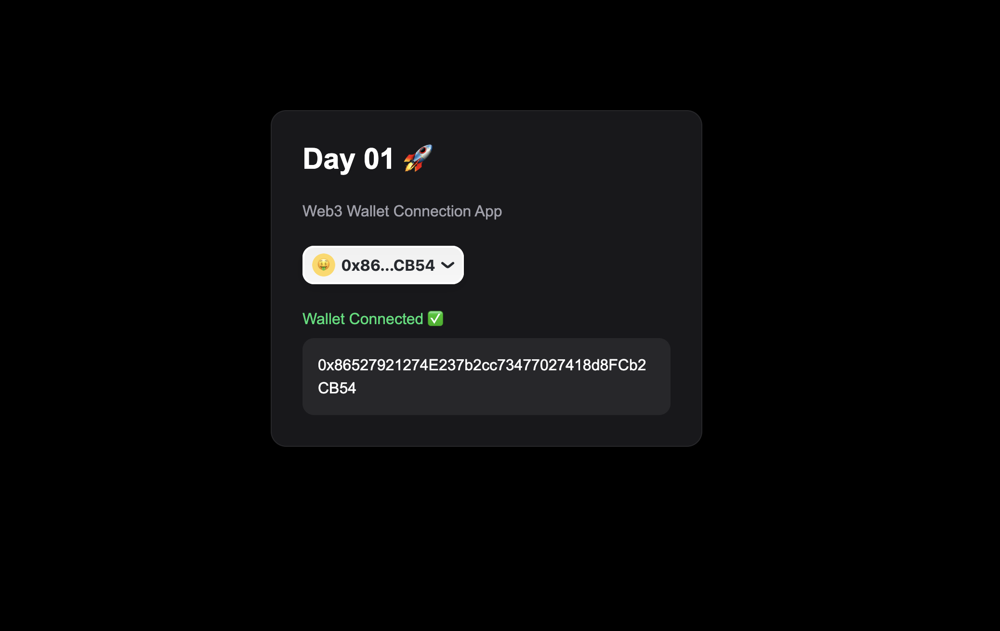

# Day 01 - Wallet Connect App 🚀

First project in my 100 Days of Web3 challenge.

## Features
- Wallet Connection
- RainbowKit Integration
- wagmi Hooks
- Wallet Address Display
- Responsive UI

## Stack
- Next.js
- TypeScript
- wagmi
- RainbowKit
- TailwindCSS

## Preview
Web3 wallet connection interface using modern tooling.

## Preview

## Day 03 — Send ETH Flow

### Features
- Send ETH Transactions
- Transaction Confirmation
- Loading States
- Success UI
- Blockchain Interaction

## Day 05 - Multi Asset Sender

### Features

- Send ETH
- Send USDC
- Ethereum Support
- Base Support
- Arbitrum Support
- Polygon Support
- Optimism Support